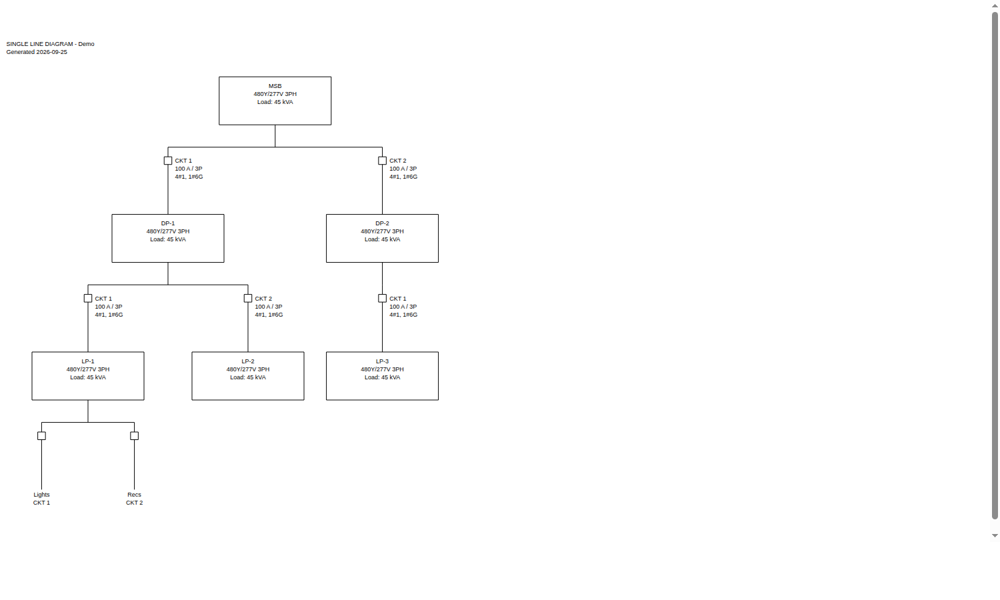
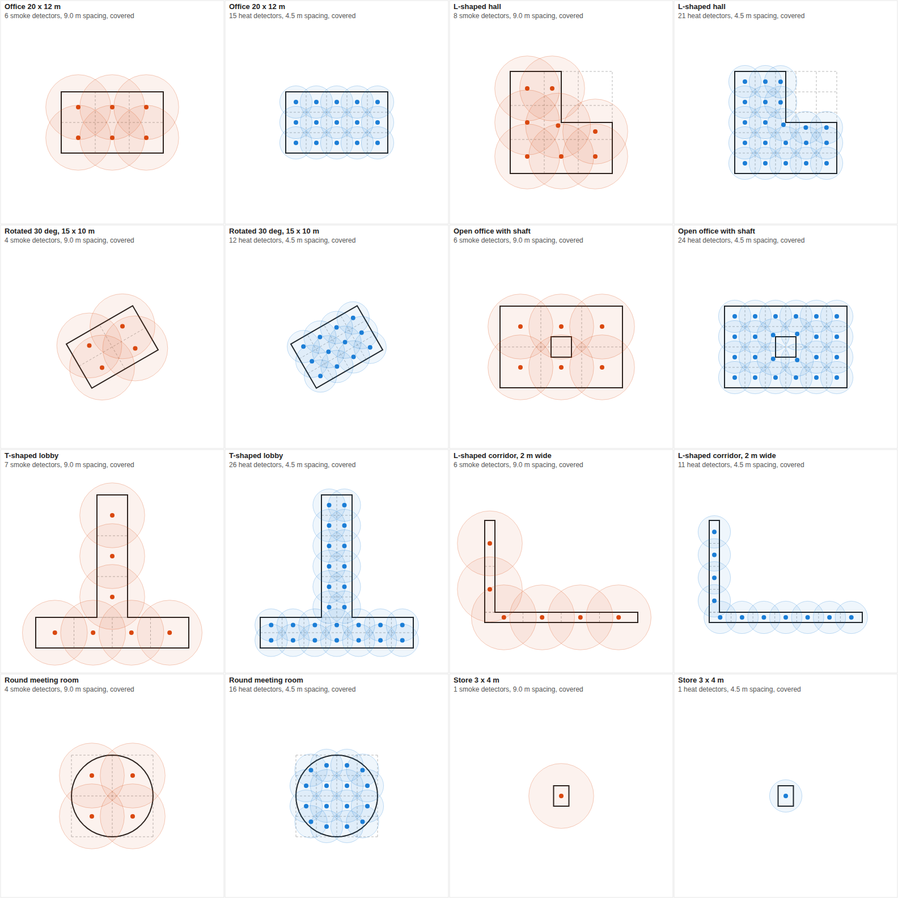
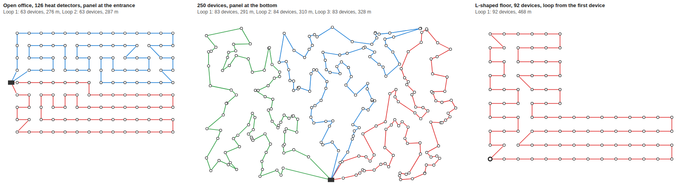
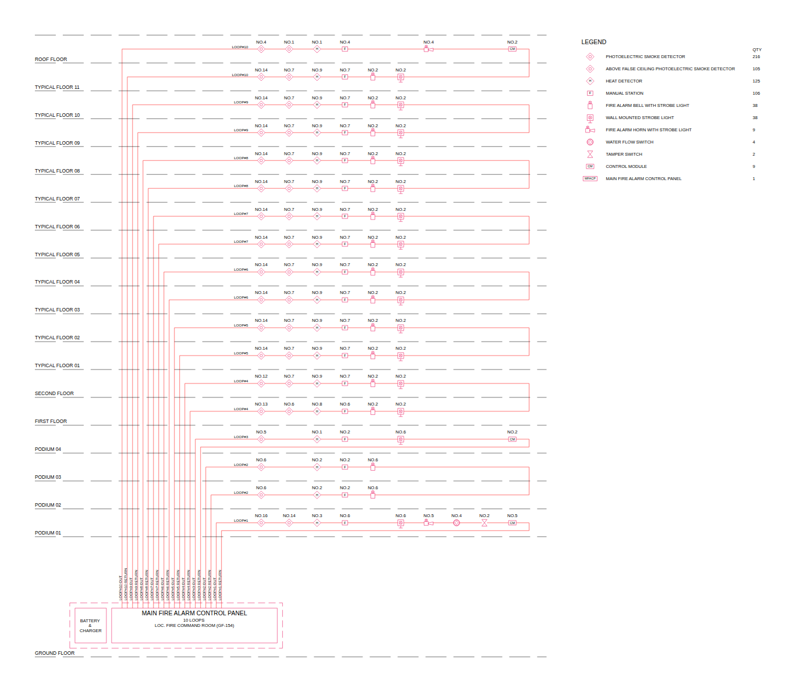
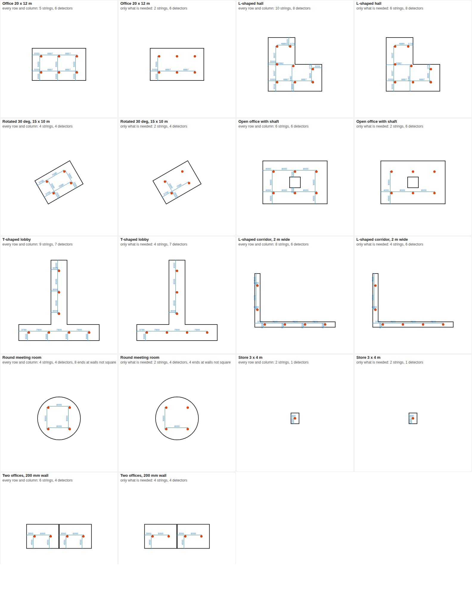

# LV Schematic Diagram for Revit (pyRevit)

A [pyRevit](https://github.com/pyrevitlabs/pyRevit) extension that automatically
draws the **low voltage system schematic diagram** of a Revit model in the
office standard format (as drawing 2427 0EE 321): boards on their floors,
every outgoing way, UPS, main boards with transformer and supply.



*Preview of the built-in Al Yasat sample (`tools/preview_svg.py`), no Revit needed.*

Everything is on one **Electrical** ribbon tab, with five panels:

| Panel | Buttons |
| --- | --- |
| **SLD** | Generate SLD, SLD Settings |
| **Fire Alarm** | Smoke Detectors, Heat Detectors, Draw FA Loop, Address Devices, FA Riser, FA Settings: places smoke and heat detectors in the selected spaces, connects the devices in loops, addresses them and draws the riser diagram, see [Fire alarm detectors](#fire-alarm-detectors), [Fire alarm loops](#fire-alarm-loops), [Addresses](#addresses) and [Fire alarm riser](#fire-alarm-riser) |
| **Voltage Drop** | Calculate VD, VD Report, VD Settings: the voltage drop of every cable and the office voltage drop sheet, see [Voltage drop](#voltage-drop) |
| **Dimensions** | Dimension Devices, Dim Settings: dimension strings from the nearest wall, device to device, in floor and ceiling plans, see [Dimensions](#dimensions) |
| **Model Check** | Wall Fixtures, Check Settings: checks in 3D that sockets, switches and other wall fixtures sit on their wall face, see [Wall fixtures](#wall-fixtures) |

## What gets drawn

| Item | How |
| --- | --- |
| **Floors** | One band per Revit level, dashed floor line and label (`ROOF FLOOR`, `GROUND FLOOR`...). Main boards go in the `SUBSTATION` band at the bottom. The diagram reads bottom to top. |
| **Boards** (MDB, SMDB, USMDB...) | Box with busbar, every outgoing way numbered 1, 2, 3... in slot order (on three-phase boards consecutive single-pole circuits share a way: R9, Y9, B9) with an `MCCB` breaker, incomer MCCB under the busbar, and `FORM 2b, 18 WAYS` / `LOCATION: ...` / `@ FLOOR` / board name. |
| **Main boards** | `FORM4-TYPE6`, `LOCATION: LV ROOM`, CT with 3 ammeters, indicator lamps, withdrawable ACB, busbar mounted fuse, SPD to earth `R<1Ω`, incoming cable, transformer, `MV CABLE FROM TAQA`, `FROM TAQA`. |
| **Final DBs** (LDB, PDB, DB-...) | Tall box with the name, at the end of the way. A DB on a higher floor than its board is drawn on its own floor, fed by a riser (like UDB-FF-01 from USMDB-GF-M). |
| **Equipment** (AHU, VRF, pumps, EV...) | Local isolator with the load name. |
| **Spare ways** | `SPARE`. |
| **PFC** | Capacitor bank symbol, `POWER FACTOR CORRECTION`. |
| **UPS** | Box across the ways that feed it; its output rises to the UPS board. |
| **Transformer fed from a board** | Transformer symbol on the way, its output rises to the panel it feeds (e.g. SWB → T-2A → PP-2A). |
| **Feeders between boards** | Risers straight up from the way, jogging around any board in the way and lining up under the fed board's incomer. |
| **Ratings** (optional) | Breaker rating and BS/IEC cable along each way, e.g. `63A TP` / `4Cx16mm² Cu/XLPE/PVC` / `+ 1Cx16mm² Cu/XLPE/PVC`. |

Buttons on the **Electrical** tab → **SLD** panel:

- **Generate SLD** – creates a new drafting view `LV Schematic Diagram`
  (`LV Schematic Diagram 2`, ... on later runs; earlier diagrams are never
  overwritten). The view is 1:1, so sizes match the printed sheet; place it
  on your A1 title block sheet.
- **SLD Settings** – utility name (`TAQA`), bottom band label (`SUBSTATION`),
  ratings on/off, and way numbering (ways in order, or Revit circuit numbers).

## How the model is read

| Drawing | Revit |
| --- | --- |
| Board / DB / main board | **Electrical Equipment**. Equipment that feeds other equipment, or whose name looks like a board (`MDB`, `SMDB`, `USMDB`, `MSB`...), is a board. Equipment with no supply is a main board. Everything else is a final DB. |
| Transformer | Electrical equipment whose family part type is *Transformer* (or family name contains `TRANSFORMER`). With no supply of its own it is drawn under the main board it feeds; fed from a board it is drawn on that board's way. |
| UPS | Electrical equipment whose family name contains `UPS`. |
| Floor | The equipment's **level**. |
| Location | The **room** the equipment is in (name + number). |
| Ways | Power circuits of the board, in slot order. Spare circuits → `SPARE`; spaces are skipped. |
| Load name | The circuit's **Load Name**. `PFC` / `POWER FACTOR` / `CAPACITOR` → PFC symbol. |
| Number of ways | *Max #1 Pole Breakers* ÷ 3 for three-phase boards. |

### Optional parameters

Add these as project or shared **Text** parameters to fine-tune the drawing.
Empty values are ignored.

| Category | Parameter | Example |
| --- | --- | --- |
| Electrical Equipment | `SLD Symbol` | `MAIN`, `BOARD`, `DB`, `UPS`, `TRANSFORMER` |
| Electrical Equipment | `SLD Form` | `FORM 2b`, `FORM4-TYPE6` |
| Electrical Equipment | `SLD Ways` | `18` |
| Electrical Equipment | `SLD Location` | `ELEC. ROOM GF-48` |
| Electrical Equipment | `SLD Description` | transformer text, one item per line: `11/0.4kV` `1000KVA` `OIL TYPE` `TRANSFORMER` |
| Electrical Equipment | `SLD Incoming Cable` | `7 SC 630mm² Cu/XLPE/AWA/PVC` |
| Electrical Circuits | `SLD Cable` | cable text printed exactly as typed |
| Electrical Circuits | `SLD Symbol` | `ISOLATOR`, `DB`, `SPARE`, `PFC` |

## Cable descriptions (BS / IEC)

Cables are generated from the circuit, e.g.
`4Cx4mm² Cu/XLPE/PVC + 1Cx4mm² Cu/XLPE/PVC`:

| Part | Taken from the circuit |
| --- | --- |
| `4C` | Number of hot + neutral conductors |
| `4mm²` | First size in Revit's *Wire Size* (needs metric wire sizes) |
| `+ 1Cx4mm²` | Number of ground conductors and the last size in *Wire Size* (reduced earths are kept) |
| `Cu` / `Al` | Wire type material |
| `XLPE` | Wire type insulation if it is an IEC type (XLPE, PVC, EPR, LSZH...), otherwise XLPE |
| `PVC` | Outer sheath (fixed, `CABLE_SHEATH` in `lib/sld/revit_sld.py`) |
| `2x(...)` | More than one parallel run |

Use `SLD Cable` for anything else (single-core, armoured...). With imperial
wire sizes Revit's wire size text is shown unchanged.

## Changing the standard

Every size, text height and fixed label (`MCCB`, `ACB`, `FORM 2b`, `BUSBAR
MOUNTED FUSE @ 20A`, `R<1Ω`...) is in
[`lib/sld/style.py`](Electrical.extension/lib/sld/style.py), in
millimetres on paper. Text notes use types named `SLD <size>mm Arial`, created
automatically and reset to these settings (size, Arial, transparent) on every
run. Text is laid out so it never needs wrapping; if you see text wrap or
touch, send a screenshot.

## Fire alarm detectors

The **Fire Alarm** panel of the **Electrical** tab:

- **Smoke Detectors** / **Heat Detectors** – select the spaces (or click the
  button and pick them, in this model or in a linked model, or take all
  spaces on a level), and a detector is placed on the ceiling so that
  detectors are at most the spacing apart and at most half of it from the
  walls: **9 m / 4.5 m for smoke, 4.5 m / 2.25 m for heat**. Every point of
  the ceiling is then within 0.71 × spacing of a detector. The new
  detectors are selected when done, one undo removes them all, and a
  summary lists each space with its count and ceiling height.
- **Draw FA Loop** – connects the fire alarm devices of the plan with
  detail lines, loop by loop, see [Fire alarm loops](#fire-alarm-loops).
- **Address Devices** – gives the devices their addresses (L1/SD-01...)
  and tags, along the loops drawn or without loop lines, see
  [Addresses](#addresses).
- **FA Riser** – draws the riser diagram from those loops, see
  [Fire alarm riser](#fire-alarm-riser).
- **FA Settings** – smoke and heat spacing, min distance from walls
  (0.5 m), the detector family type for smoke and for heat, devices per
  loop (120), square or straight loop lines, the loop line gap at
  devices (2 mm), the riser symbol of each fire alarm type, and the tag
  for the addresses.



*Sample rooms (`tools/preview_detectors.py`): dashed lines are the grid
bays, circles show each detector's reach.*

### How the detectors are laid out

1. The grid is lined up with the space's main walls (rotated rooms get a
   rotated grid).
2. Along each direction the space is split into equal bays no longer than
   the spacing, with a detector in the middle of each bay – e.g. a 20 × 12 m
   office gets 3 × 2 smoke detectors, 6.67 m × 6 m apart, 3.33 m / 3 m from
   the walls.
3. In L, T and U shapes, around shafts and columns, the part of a bay
   inside the space gets its detector in its middle. Spaces with square
   walls are also tried as separate rectangles (the bar and the stem of a
   T); the layout with fewer detectors is used.
4. The whole ceiling is checked on a fine grid (spacing / 20) plus points
   along every wall; any point out of reach gets another detector.

Detectors stay at least 0.5 m from walls and columns, except in spaces
too narrow for it, where they go on the centreline.

### In Revit

| Item | How |
| --- | --- |
| Spaces | MEP **Spaces** or **Rooms**, in this model or in **linked models**. Select them before clicking the button, or after clicking choose: *Pick spaces in this model*, *Pick spaces or rooms in a linked model*, or *All spaces or rooms on a level* (this model or one link, one or more levels). On Revit 2023+ spaces Tab-selected inside a link before clicking are used too. The outline is the boundary at the wall finish face; shafts and columns cut out of it are kept clear. |
| Linked spaces | The outline is moved into this model with the link's position and rotation, and the detectors are placed in this model. To pick them, the link's Rooms / Spaces must be visible in the view (Visibility/Graphics → Revit Links → the link → Rooms or Spaces, *Interior* or *Reference*); *All spaces or rooms on a level* works whatever the view shows. Level-based families go on this model's level at or below the space's floor. |
| Ceiling | A ray is shot straight up from each detector point and the detector goes on the **ceiling** under the slab above – in this model or in a linked model. Where there is no ceiling under the slab it goes on the slab (floor or roof), and the summary says so; floors lower than 1.5 m (stages, raised floors) are ignored. |
| Detector family | Any family in the **Fire Alarm Devices** category. Face-based families go on the ceiling face (host or linked ceiling), ceiling-hosted families on the ceiling (only ceilings in this model can host), level-based families at ceiling height. The type is asked the first time and remembered; change it in FA Settings. |
| Detectors already there | Detectors of the same type already in the selected spaces can be replaced or kept. |

## Fire alarm loops

**Draw FA Loop** (Fire Alarm panel) connects the fire alarm devices of the
open floor or ceiling plan with detail lines. Every loop leaves the start –
the panel, or the device you click – passes each of its devices once and
comes back to the start. Lines are **square**: horizontal and vertical
along the grid the devices are laid out on, meeting each device at right
angles (FA Settings can switch to straight lines device to device). One
plan (one floor) at a time.

1. Select the devices, or click the button and choose *All fire alarm
   devices in this view* or *Pick devices*.
2. Choose the loop: a **detection loop** (detectors, manual stations,
   modules... everything but sirens and flashers) or a **sounder loop**
   (sirens and flashers only: bells, sounders, horns, strobes, beacons,
   bell + strobe, horn + strobe). Only those devices go on it.
3. Click the start: the fire alarm panel, or the first device.
4. The loops are drawn, and a summary gives each loop's devices and
   length of line.
5. Give the devices their addresses with **Address Devices**
   ([Addresses](#addresses)).



*Sample loops (`tools/preview_loops.py`); the square is the panel, the
thick circle a start device. Bottom right: an open space on a grid and a
core of small rooms.*

### How the route is found

- **Up to 120 devices** (FA Settings) make one loop. More devices are
  split into as few loops as possible, of equal size (250 devices: 83 +
  84 + 83), each one area of the floor. Two splits are tried and the one
  with less line is kept: by direction from the start, like slices of a
  pie, so every loop begins right at the panel; and by cutting the floor
  in two across its longer side, and again, until each part is one loop.
- **Shortest route**: from the start to the nearest device and so on, then
  improved until nothing shortens it – turning stretches of the route
  round (2-opt) and moving one to three devices elsewhere (or-opt). Square
  loops measure along the grid (across plus up), also start from routes
  shaped for a grid (snakes along the rows or columns, and combs – a snake
  back along one edge column), and never pass a device on a row or column
  without stopping at it: on a grid the route snakes along the rows and
  columns as drawn by hand.
- **Square lines**: devices in line (a row or column, within half a
  device) get one straight line. Other steps get an L with one right-angle
  bend, on the side that runs through no other device and crosses or
  overlaps the fewest lines drawn; when both Ls run through a device, a Z
  that jogs half way between. The grid direction is found from the
  devices (a wing at an angle gets lines at that angle), else the view's.
  Straight loops never cross themselves.
- **Numbering**: anticlockwise round the start, from one side of the
  panel's wall round to the other; the loop of the start device first.
  Each loop also runs anticlockwise round what it encloses, so its
  addresses go that way round.

### In Revit

| Item | How |
| --- | --- |
| Devices | Fire alarm devices shown in the view (family instances of the Fire Alarm Devices category, not nested parts), or the devices selected or picked (any family at a point). |
| Start | The element you click. A panel (Electrical Equipment, or a family or type named PANEL, FACP, MFACP or CIE) is only where the loops start and come back to; any other device is device 1 of loop 1. When the devices are split into several loops, they all start and end there. |
| Lines | Detail lines in the plan, square (right angles) or straight from device to device (FA Settings), and back to the start. They stop at the edge of each device (its box in the view) and at least 2 mm on paper from its centre (FA Settings). |
| Line styles | **FA Loop 1**, **FA Loop 2**... – one per loop, made the first time in red, blue, green, magenta, orange... Change colour, weight or pattern in Manage → Additional Settings → Line Styles. |
| Loop numbers | L1, L2... go on across the building, detection and sounder loops sharing them: when loops are already drawn (or addressed without lines) on other floors, the new ones get the next free numbers (ground floor L1 and L2, first floor from L3...). Or choose *Continue Ln*: this floor's first loop keeps that number, its addresses go on counting, and the riser draws the loop over both floors. |
| Sounder loops | Drawn with the **FA Sounder Loop n** line styles (detection loops: **FA Loop n**), so drawing one never replaces the detection loop lines of the view, and the other way round. |
| Drawing again | Loop lines of the same kind already in the view are replaced, or kept and new loops added with new numbers (to draw separate zones one after the other). One undo removes a run. |
| Lengths | Along the lines in plan (square: across plus up), start to start, without drops and risers. |

### Addresses

**Address Devices** (Fire Alarm panel) writes every device's address in
the **FA Address** parameter and tags it:

```
L1/SD-01   L1/SD-02   L1/MCP-03   L1/HD-04 ...   L5/BS-01   L5/ST-02 ...
```

loop / device type - number. The number is the device's place on the loop
in route order from the panel, one count for all types (01 ... 99, then
100 ... 120). Types: SD smoke detector (also above false ceiling, raised
floor, trench), HD heat, DD duct, TX / RX beam transmitter / receiver, MCP
manual station, B bell, BS bell + strobe, ST strobe / flasher, HS horn +
strobe, J telephone jack, FS flow switch, TS tamper switch, CM / MM / ZM
control / monitor / zone module, LHD linear heat detector, HSSD, EOL, ISO
isolator; another type gets its initials. The type comes from the same
symbol as on the riser (FA Settings → Riser symbols).

Click the button and choose which devices:

- **Loops drawn in this plan** – each FA Loop / FA Sounder Loop of the
  open plan is followed along its lines from the panel, device after
  device, the way the lines go (drawn by Draw FA Loop or by hand). A loop
  going on from another floor counts on after the numbers there; devices
  addressed before keep their numbers when they still fit.
- **Loops drawn in all plans** – the same for every plan with loop lines.
  A loop over several floors is counted floor after floor, **the floor
  furthest from the panel first** (as on the riser), each loop from 01.
- **Devices without a loop line** – the devices selected (or all the fire
  alarm devices of the plan, or picked): choose detection or sounder,
  click the panel or the first device, and choose new loop numbers or
  *Continue Ln*. They are counted in the order Draw FA Loop would connect
  them, without drawing lines; more than 120 (FA Settings) are split into
  more loops, as Draw FA Loop does.

How the lines are followed: a line ending at a device (within its box, or
the line gap) belongs to that device; lines meeting at a bend join; the
line ends at the panel – a fire alarm family or electrical equipment
named FACP, MFACP or ...CONTROL PANEL shown in the plan – or else the ends
at nothing, are the start. From there the count goes **anticlockwise**
round the loop, the way Draw FA Loop routes every loop (a loop out along a
row and back: the nearer end first). Loops drawn from a device (no free
ends) start at the device the plan's loops share, the one Draw FA Loop
started them from, counted on the lowest loop only; a single loop drawn
from a device starts at the device nearest the main panel, and the
summary names it. The summary lists each loop's floors, devices and first
and last address, and selects the devices that need a look: devices at a
loop's lines that no line from the start reaches (lines not joined: they
are not addressed), devices on the routes of two loops (addressed on the
first), and other devices that had an address given now (left from
before).

**FA Address** is a shared parameter (text, instance) from
`Electrical.extension/FA shared parameters.txt`, added to Fire Alarm
Devices the first time devices are addressed; schedules can show it.

**Address tags.** Address Devices places a tag on every device it
addresses (above and to the right, no leader) in the plan of its loop,
with the tag type chosen the first time (or in FA Settings → Address
tag). A device with that tag already keeps it where it is: the tag shows
the new address. Revit does not let add-ins make the label of a tag family, so make
the tag once:

1. **File → New → Annotation Symbol**, template *Fire Alarm Device Tag*
   (*Metric Fire Alarm Device Tag.rft*).
2. **Create → Label**, click in the view.
3. In *Edit Label* click **Add Parameter** (bottom left) → **Select...** →
   **Browse** to `Electrical.extension/FA shared parameters.txt` → group
   *Fire Alarm* → **FA Address** → OK, OK.
4. Move **FA Address** to *Label Parameters* → OK. Set the text size (e.g.
   1.8 mm) in the label's type.
5. Save it (e.g. *FA Address Tag.rfa*) and **Load into Project**.

With no tag loaded the addresses are still written, and the summary says so.

## Fire alarm riser

**FA Riser** (Fire Alarm panel) draws the fire alarm riser diagram in a new
drafting view, *FA Riser Diagram* (1:1, earlier ones are never
overwritten), from the loops drawn with **Draw FA Loop**, in the office
format:



*Sample building (`tools/preview_riser.py`): podiums, typical floors in
pairs on one loop, the roof with typical floor 11.*

- **Floors** bottom to top, dashed floor lines with the level names.
- **Main panel** on its floor: MAIN FIRE ALARM CONTROL PANEL, the number
  of loops and its room (LOC. ...), with BATTERY & CHARGER, in a dashed
  frame.
- **Every loop** leaves the panel with an OUT line and comes back with a
  RETURN line (red, labelled LOOP#n OUT / RETURN up the riser). A loop on
  two floors (the same loop number drawn on both) runs OUT along the upper
  floor, across at the right end and RETURN along the lower floor; a loop
  on one floor comes back just under its row. Loops to the furthest floors
  take the outer riser lines, so no lines cross. Floors below the panel
  (basements) get their loops going down.
- **Symbols** of the office legend, in columns in the legend order, with
  the quantity (NO.14) above each, and a **legend** with the total of each.

### How the model is read

| Item | How |
| --- | --- |
| Loops | A device is on loop n when an FA Loop n (or FA Sounder Loop n) line of a floor or ceiling plan ends at it (within half its box); sounder loops are drawn like the others, with their sirens and flashers. Devices no loop line reaches are listed in the summary, per floor. |
| Floor | The device's level, else its schedule level, else the level below it. |
| Main panel | A fire alarm device or electrical equipment named MFACP, FACP, CIE or ...CONTROL PANEL (MAIN or MFACP first). Its level is the panel's floor, its room the LOC. text. With none, the panel is drawn on the lowest floor. |
| Symbol | The type's `FA Symbol` parameter (a code such as `SD`, `MCP`, `BELLS`, or the legend description), else the one chosen in **FA Settings → Riser symbols**, else a guess from the family and type name: SMOKE / OPTICAL / PHOTO → photoelectric smoke detector (ABOVE / FALSE CEILING, RAISED FLOOR, TRENCH, DUCT, BEAM TX / RX variants), HEAT → heat detector, MANUAL / CALL POINT / MCP / BREAK GLASS → manual station, BELL / SOUNDER (with STROBE / BEACON) → bell (with strobe), HORN → horn with strobe, STROBE / BEACON / VAD (CEILING) → wall (ceiling) strobe, TELEPHONE / JACK, FLOW, TAMPER, MONITOR → MM, CONTROL / RELAY → CM, ZONE → ZM, LINEAR HEAT, VESDA / ASPIRATING → HSSD, REPEATER, EOL, ISOLATOR. A type nothing fits gets a box with its initials and its own legend line. The summary lists every type with its symbol. |
| Line styles | **FA Riser Wiring** (loop lines) and **FA Riser Symbols** (symbols, panel), made red the first time; text notes use the `SLD <size>mm Arial` types. |

## Voltage drop

The **Voltage Drop** panel of the **Electrical** tab:

- **Calculate VD** – calculates the incoming cable of every panel, from the
  transformer down, and every final circuit with a length. Writes
  `VD Percent` and `VD Total Percent` on each panel and lists the results
  in the output window: first a **To fix** list of what is missing in the
  model (lengths, cable sizes, loads, breaker ratings), then every cable
  that fails with the breaker or cable that would pass (e.g. `V.D 5.52% >
  4%; use 4Cx25mm²`). Click an element id to select the panel.
- **VD Report** – saves the calculation as an Excel file in the office
  voltage drop sheet format (S.N, FROM, TO, DISTANCE ... CUMULATIVE V.D (%),
  MAX V.D %) with a REMARKS column, and next to it the same report as PDF
  (saved by Excel, A3 landscape, page numbers), and opens the PDF. The
  Excel cells hold formulas, so a length or load changed in Excel updates
  the voltage drop. The PDF needs Microsoft Excel on the computer.
- **VD Settings** – voltages (400 / 230 V, or the model's), power factor (0.85, or the model's), demand (MDL) or
  connected (TCL) load, limits, default cable and installation, derating
  values and the report title block (company, revision, issue).

The SLD is not changed.

### Typing the lengths

Everything about a panel's incoming cable is typed on the **panel**. The
first time you click **Calculate VD** it offers to add these instance
parameters, and a **Voltage Drop Panels** schedule (panel name, supply
from, MCB rating, mains, demand load and the VD parameters) where you type
every length in one place:

| Parameter | Type | On | What you type |
| --- | --- | --- | --- |
| `VD Length` | Text | panels, circuits, electrical and lighting fixtures, mechanical equipment | length of the incoming cable in metres: `175`, `175 m` (also `mm`, `ft`) |
| `VD Installation` | Text | panels, circuits | `Cable Tray`, `Duct Bank` or `Ground`; empty = VD Settings |
| `VD Cable` | Text | panels, circuits | when Revit's wire size is not the cable: `4Cx16`, `4x4Cx300`, `11x1Cx630 XLPE/SWA/PVC` |
| `VD Load kW` | Text | panels, circuits | only to override the load: the maximum demand in kW |
| `VD PF` | Text | panels, circuits | only to override the power factor: `0.9` or `90%` |
| `VD Percent` | Number | panels, circuits | result: voltage drop of the incoming cable (%) |
| `VD Total Percent` | Number | panels, circuits | result: cumulative voltage drop at the panel (%) |

Every panel fed from another panel or a transformer gets a row (a missing
length is reported). A main board with no supply circuit gets a row for the
cable from the transformer when `VD Length` (and `VD Cable`, e.g.
`11x1Cx630`) is typed on it.

Final circuits (AHU, pumps, lights...) are calculated when `VD Length` is
typed on their equipment or fixtures; with several on one circuit the
farthest one counts. A value typed on a circuit is still used when the
panel or fixture has none.

### What is read from Revit

For a panel's incoming cable:

| Sheet column | Revit |
| --- | --- |
| FROM / TO | Supply From (the board feeding it) / Panel Name |
| PHASE | the panel's distribution system |
| VOLTAGE | 400 V three phase / 230 V single phase from VD Settings, as the office sheet; or, if VD Settings says so, the panel's distribution system |
| TCL (kW) | Total Connected, as in the model (Revit's kVA x the power factor of the panel's own loads: loads entered in kW at PF 1 give the same number) |
| MDL (kW) | `VD Load kW`, or Total Estimated Demand the same way (with MDL in VD Settings), else TCL |
| MDL (kVA) | MDL (kW) / PF, with the PF below |
| PF | 0.85 from VD Settings on every cable, as the office sheet; `VD PF` typed on a panel overrides it. Optionally (VD Settings) the panel's own loads: true load / apparent load of its circuits |
| Breaker rating | MCB Rating, else Mains, else the feeding circuit's Rating |
| Runs, cores, CSA | `VD Cable`, else `SLD Incoming Cable`, else the feeding circuit's wire size (Revit keeps it only there) |
| Insulation | from `VD Cable`, else VD Settings (XLPE/SWA/PVC) |

A final circuit is read from the circuit (its panel, load, rating, poles,
voltage, wire size), with the length from its loads.

The cable tables are metric: with imperial wire sizes (`3-#4/0, 1-#4/0`)
use a metric wire size table in Revit or type each cable in `VD Cable`.
Set the **MCB Rating** (or Mains) of every panel: without it the breaker
is the feeding circuit's Rating, which Revit sets to 20 A for new circuits.

### How it is calculated

As the office sheet:

```
I (A)       = MDL kVA x 1000 / (√3 x 400 V)          single phase: / 230 V
breaker     In >= 1.1 x I
cable       Iz = rating x runs x Cb x Ca x Cr x Cg >= In
V.D (V)     = mV/A/m / runs x L (m) x I (A) / 1000
V.D (%)     = V.D / V x 100
cumulative  = V.D (%) + cumulative V.D (%) of the cable feeding the FROM board
limit       2.5 % transformer to main board, 4 % to the final load
```

Ratings, mV/A/m and the derating factors Ca (temperature), Cb (depth) and
Cr (soil thermal resistivity) are the office sheet's DUCAB XLPE tables, in
[`lib/vdrop/tables.py`](Electrical.extension/lib/vdrop/tables.py). Where
the tool differs from the sheet:

- √3 instead of 1.73 (0.12 % lower).
- Single phase cables use 230 V and 2/√3 x the three phase mV/A/m (the
  sheet has no single phase rows).
- The cumulative total starts again after a transformer or a UPS.
- Cr uses the size bands of the table headings (multicore up to 16 / 150
  mm², single core up to 150 / 300 mm²); the sheet's formula uses 16 / 240
  for both. Same result with resistivity 0, as in the sheet.
- Cb and Cr are picked by single core / multicore, the sheet picks them by
  the number of phases.
- Only XLPE cables: the sheet's `ref_PVC` tab is a copy of the XLPE data.

## Dimensions

The **Dimensions** panel of the **Electrical** tab:

- **Dimension Devices** – dimensions the devices of a floor plan or
  ceiling plan (smoke and heat detectors, lights...) with a string along
  each row and each column of devices: from the nearest wall, device to
  device. Devices on walls (sockets, switches, data outlets...) get a
  string along their wall, from the nearest corner. Select the devices
  first, or the spaces or rooms they are in,
  or after clicking take *All devices in this view*, *Pick devices*, or the
  devices in spaces or rooms you pick (in this model or in a linked model).
  When the devices are of more than one category you tick the ones to
  dimension. The new dimensions are selected when done, one undo removes
  them all, and a summary lists what could not be dimensioned.
- **Dim Settings** – dimension type (the model's default until you pick
  one), distance from the devices to the dimension line (8 mm on the
  printed sheet), every row and column or only what is needed, and the
  walls: the nearest one only, both (wall to wall), or none (between
  devices only).



*Sample rooms with the detectors the Smoke Detectors button places
(`tools/preview_dims.py`): every row and column on the left, only what is
needed on the right.*

### How the strings are made

1. Each device is dimensioned along its own axes, so detectors placed by
   Smoke / Heat Detectors in a rotated room get strings square to the room.
2. Devices lined up across (within 20 mm) are a row. A row is cut where a
   wall runs between two of its devices, so a string never crosses a wall.
3. A string starts at the nearest wall face: the one before its first
   device or the one after its last device, whichever is nearer (the one
   before when they are as near). A wall that is not square to the string
   (round walls, devices not turned with the room) cannot be dimensioned,
   so the wall at the other end is taken. Dim Settings can also give both
   walls, or none.
4. *Only what is needed* leaves out a row whose devices only repeat
   positions that another row of the same room already dimensions: a
   regular grid then gets one string along and one across.

The dimension line is on the side of its text (above horizontal strings,
left of vertical ones), so the text stays clear of the devices.

### In Revit

| Item | How |
| --- | --- |
| View | The active floor plan or ceiling plan. The dimension line is 8 mm on the printed sheet from the devices (0.8 m at 1:100), so its witness lines run clear of the device symbols and show which device each one is for. |
| Devices | Family instances in this model. *All devices in this view* and spaces take fire alarm devices, lighting fixtures and devices, electrical fixtures, communication, data, security, nurse call and telephone devices, and generic models; selected or picked devices can be of any category. Devices in linked models are not dimensioned. |
| Dimensioned to | The centre reference planes of the family, *Center (Left/Right)* and *Center (Front/Back)*, which Autodesk's family templates have. A centre plane set as a Strong or Weak reference is found by its name, or else by its position (the reference plane through the insertion point). A family with none (centre planes set to *Not a Reference*) is dimensioned to invisible detail lines drawn in the view through each device's centre, and the summary says so. Those dimensions do not move with the devices: run the tool again after moving them, it replaces the old dimensions and lines. For dimensions that move with the devices, set *Is Reference* of the family's centre planes to *Center (Left/Right)* / *Center (Front/Back)*. |
| Devices on walls | Face-based families on a wall, and wall-hosted families. They are dimensioned along their wall only (never across the room), from the nearest corner. Their rays start 150 mm into the room, and the dimension line goes into the room: 8 mm from the wall, and at least 9 mm when the text would face the wall, so it clears the symbols. Where two strings would cross or run over each other's text (two walls dimensioned from the same corner), one of them goes behind its wall instead, clear of the wall's thickness; the summary says how many. |
| Walls | Walls, curtain panels and mullions, in this model or in linked models, found by rays shot from the devices along the string: one 150 mm below each device (for ceiling devices: under the ceiling and above the doors), one 0.5 m above the level (under the windows, and for walls that stop below the ceiling). A door or window a ray meets stands for the wall it is in, so a string never goes through a doorway or a window. The nearer wall wins; the lower ray passes walls under 2 m high. A wall in a link is dimensioned through the link; when Revit does not take it, the string is made without that wall and the summary says so. When no wall is found on one side, or it is not square to the devices, the string goes to the wall on the other side, and the summary says so. |
| Existing dimensions | Dimensions in the view that already go to the devices (or to their helper lines) can be replaced or kept. |

Mounting heights of devices on walls are not dimensioned (they are for
elevations or tags).

## Wall fixtures

The **Model Check** panel of the **Electrical** tab:

- **Wall Fixtures** – checks in 3D that the fixtures on walls (sockets,
  switches, wall lights, panels, fire alarm, data and security
  devices...) sit on their wall face. Select the fixtures first, or after
  clicking take *All fixtures in the model*, *Fixtures shown in this
  view*, or *Pick fixtures*. The fixtures that need a look are selected
  in Revit, and pyRevit's output window lists them by problem, with what
  to do about it; click an element id to select it and zoom to it, or
  *Select all*. Nothing in the model is changed.
- **Check Settings** – the tolerance: how near its wall face a fixture
  must be to count as on the wall (10 mm).

### What is checked

| Problem | When |
| --- | --- |
| Lost their wall | A face-based or wall-hosted family with no host any more (the wall was deleted). |
| On a wall in a link that is not loaded, or no longer in it | Hosted by a face in a linked model, and that wall cannot be found: the link is unloaded, or the wall was deleted from it. |
| Off the end or the top of their wall, or in an opening | The insertion point is not over a side face of its wall: the wall was shortened, lowered, or a door or window was put where the fixture is. |
| Floating off the wall face | The whole fixture is more than the tolerance in front of the wall face (typically a fixture on a linked wall that moved, or a wall that got thinner). |
| Set into the wall | The insertion point of a face-based fixture is more than the tolerance behind the wall face. |
| Inside the wall | The whole fixture is more than the tolerance behind the wall face. |
| Facing into the wall / Not square to the wall | A face-based fixture turned away from its wall face by more than 2° (a linked wall that was turned). |
| On a work plane, not on a wall | A face-based fixture placed on a level or reference plane: it does not move with the wall. |

### In Revit

| Item | How |
| --- | --- |
| Fixtures | Family instances of electrical fixtures, lighting devices and fixtures, electrical equipment, fire alarm, communication, data, security, nurse call and telephone devices for *All* and *this view*; selected or picked fixtures can be of any category. |
| Checked | Face-based families on a wall face (in this model or a linked model) and wall-hosted families. Fixtures on ceilings, floors and roofs, on columns or other hosts, and families that are not hosted at all are counted under *Not checked*. |
| Measured | Against both side faces of the wall, in 3D: the fixture's insertion point (face-based families have it on the face they are placed on) and the points of its 3D geometry. The fixture's side is the face its insertion point is nearest, or for wall-hosted families the face its body sticks out of most. A back box behind the face is fine as long as part of the fixture is in front of it, so flush fixtures pass. |
| Not read | Curtain walls and walls whose faces Revit cannot give. |

## Circuit descriptions

The **Panel Schedules** panel of the **Electrical** tab:

- **Circuit Description** – fills the circuit description (the circuit's
  *Load Name*, the CIRCUIT DESCRIPTION column of the panel schedules)
  with the room its fixtures are in, read from the architectural link:
  `012 FIRE FIGHTING PUMP ROOM`. When a circuit's fixtures are in several
  rooms, each room is written once, in order: `101 OFFICE, 102 CORRIDOR`.
  The LOAD columns are filled too: the circuit's fixtures by type, into
  its `Load1_Type`, `Load1_Nos`, `Load1_WpU` ... `Load6_` parameters,
  most fixtures first. TYPE is the fixture type's *Type Comments* (its
  type name when blank), W PER UNIT the load of one fixture.
  Open a panel schedule or select boards first, or pick the boards after
  clicking. Every change is listed (board, circuit, was, now) to untick
  before anything is written, in one transaction (one Undo). The report
  lists the circuits whose fixtures are in no room; they keep their
  description.
- **Description Settings** – how a room is written (number + name, name
  only, name + number), in capitals or not, and whether this model's
  rooms and spaces are used when a fixture is in no linked room.

| Item | How |
| --- | --- |
| Circuits | Power circuits of the boards. Spares and spaces are left alone, and so are circuits feeding other boards and circuits with nothing connected. |
| Room of a fixture | The room of the loaded links (the architectural model) at the fixture's insertion point; then 300 mm in front of and behind it (fixtures on a wall face sit on the room boundary); then higher and lower, down to its level (ceiling lights are above the room's height). Then the spaces and rooms of this model, if the setting allows. |
| W PER UNIT | The fixture's *Apparent Load*, else an instance or type parameter named *Apparent Load*, *Wattage*, *Load*, *Power*, *Apparent Power* or *Watts*. When one type of the circuit has no load, it is worked out from the circuit's apparent load. Fixtures of the same type with different loads are separate groups. |
| Written | The *Load Name* and the existing `LoadN_Type` / `LoadN_Nos` / `LoadN_WpU` parameters (groups not used are cleared). No parameter is created. |

## Install

1. Install pyRevit.
2. Download this repository and unzip it somewhere permanent.
3. In Revit: **pyRevit tab → Settings → Custom Extension Directories → Add
   folder**, pick the folder that *contains* `Electrical.extension`, save
   and reload. The **Electrical** tab appears.

Updating from a version with three tabs (SLD, Fire Alarm, Voltage Drop):
delete the old `SingleLineDiagram.extension`, `FireAlarm.extension` and
`VoltageDrop.extension` folders, then reload.

Button icons are drawn by `tools/make_icons.py` (`icon.png`, and
`icon.dark.png` for Revit's dark theme).

Works with pyRevit's IronPython 2.7 and CPython 3 engines.

## Preview without Revit

```
python tools/preview_svg.py preview.svg
```

draws the Al Yasat sample (`tools/sample_al_yasat.py`) as an SVG you can open
in a browser. Edit the sample to try other arrangements.

```
python tools/preview_detectors.py detectors.svg [smoke spacing] [heat spacing]
```

draws the detector layout of the sample rooms (`tools/sample_rooms.py`).

```
python tools/preview_loops.py loops.svg [devices per loop] [straight]
```

draws sample fire alarm loops: an open office with a panel on the wall,
250 scattered devices split into three loops, an L-shaped floor, and an
open space with a core of small rooms.

```
python tools/preview_riser.py riser.svg [pixels per mm]
```

draws the fire alarm riser of the sample building (`tools/sample_riser.py`).

```
python tools/preview_vd_report.py report.xlsx
```

saves the voltage drop report of the sample cables (`tools/sample_vd.py`,
the rows of an office voltage drop sheet).

```
python tools/preview_dims.py dims.svg [spacing]
```

draws the dimension strings of the sample rooms with their detectors.

## Project layout

```
Electrical.extension/
  Electrical.tab/
    SLD.panel/            Generate SLD, SLD Settings
    Fire Alarm.panel/     Smoke Detectors, Heat Detectors, Draw FA Loop, Address Devices,
                          FA Riser, FA Settings
  FA shared parameters.txt   the FA Address shared parameter
    Voltage Drop.panel/   Calculate VD, VD Report, VD Settings
    Dimensions.panel/     Dimension Devices, Dim Settings
    Model Check.panel/    Wall Fixtures, Check Settings
    Panel Schedules.panel/  Circuit Description, Description Settings
  lib/sld/
    model.py       boards, ways, UPS, transformer from equipment + circuits
    layout.py      floors, placement, riser routing
    symbols.py     breaker, isolator, DB box, PFC, transformer, ACB... symbols
    geometry.py    lines, arcs and text primitives (mm)
    style.py       the drawing standard: sizes, text heights, fixed labels
    cables.py      BS / IEC cable descriptions
    revit_sld.py   reads the Revit model, draws into a drafting view
    settings.py    per-user settings
    command.py     button entry points
  lib/firealarm/
    layout.py      detector points in a space outline (no Revit)
    revit_fa.py    spaces (here or in links), ceilings found by ray, placing
    loops.py       fire alarm loops: split, shortest routes, line ends (no Revit)
    revit_loop.py  devices of the plan, loop line styles, detail lines
    riser.py       riser diagram layout: floors, panel, loops, symbols (no Revit)
    riser_symbols.py  the office legend symbols, which symbol a type gets
    revit_riser.py devices, floors and loop lines read, riser drawn
    addresses.py   addresses L1/SD-01, loop kinds (no Revit)
    loop_order.py  the route of a loop read back from its lines (no Revit)
    revit_routes.py   loops drawn in the plans read back device by device
    revit_address.py  FA Address parameter, addresses written, address tags
    report.py      summaries shown after placing, drawing loops, addressing and the riser
    settings.py    per-user settings
    command.py     button entry points
  lib/vdrop/
    calc.py        voltage drop, cable and breaker checks, suggestions (no Revit)
    tables.py      cable ratings, mV/A/m, derating factors of the office sheet
    parse.py       reading the typed lengths, cables, installations
    report.py      the report in the office sheet layout, results summary
    excel.py       saving the report as PDF with Excel (COM)
    xlsx.py        small .xlsx writer (standard library only)
    revit_vd.py    panels and circuits to rows, results to parameters, setup
    settings.py    per-user settings
    command.py     button entry points
  lib/dims/
    chains.py      rows, columns and walls to dimension strings (no Revit)
    report.py      summary shown after dimensioning
    revit_dims.py  devices and their centre planes, walls found by ray, dimensions
    settings.py    per-user settings
    command.py     button entry points
  lib/wallcheck/
    check.py       is a fixture on its wall face: floating, set in, off the wall... (no Revit)
    report.py      the problems by kind, what to do, not checked
    revit_check.py fixtures, their host wall (here or in a link), faces and geometry measured
    settings.py    per-user settings
    command.py     button entry points
  lib/circuitdesc/
    describe.py    room labels, descriptions, what happens to each circuit (no Revit)
    revit_desc.py  boards and circuits, the room of each fixture in the links, Load Name written
    settings.py    per-user settings
    command.py     button entry points
tools/             sample models, SVG and report previews, icon drawing
tests/             pytest tests (no Revit needed)
```

## Development

```
pip install pytest
python -m pytest tests
```

Keep code in `lib/sld`, `lib/firealarm`, `lib/vdrop`, `lib/dims` and `lib/wallcheck` compatible with Python
2.7 (no f-strings, no type hints) so it runs in pyRevit's IronPython engine.
